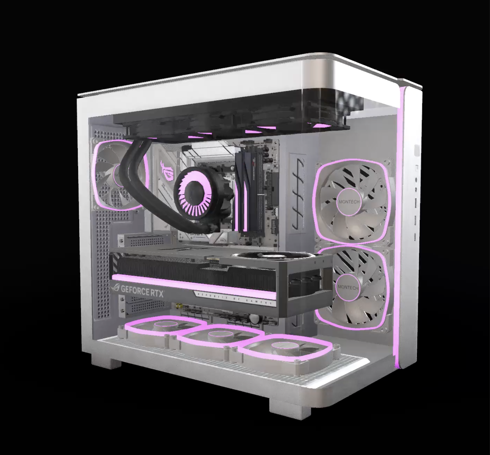

# @buildcores/render-client

A React component library for interactive 360-degree PC build rendering with drag-to-scrub functionality. Create immersive 3D visualizations of computer builds that users can rotate and explore.



_Interactive 3D PC build that users can rotate by dragging_

## 🚀 Installation

```bash
npm install @buildcores/render-client
```

## 📖 Quick Start

```tsx
import React from "react";
import { BuildRender, getAvailableParts } from "@buildcores/render-client";

function App() {
  const parts = {
    parts: {
      CPU: ["7xjqsomhr"], // AMD Ryzen 7 9800X3D
      GPU: ["z7pyphm9k"], // ASUS GeForce RTX 5080 ASTRAL
      RAM: ["dpl1iyvb5"], // PNY DDR5
      Motherboard: ["iwin2u9vx"], // Asus ROG STRIX X870E-E GAMING WIFI
      PSU: ["m4kilv190"], // LIAN LI 1300W
      Storage: ["0bkvs17po"], // SAMSUNG 990 EVO
      PCCase: ["qq9jamk7c"], // MONTECH KING 95 PRO
      CPUCooler: ["62d8zelr5"], // ARCTIC LIQUID FREEZER 360
    },
  };

  return (
    <div>
      <BuildRender
        parts={parts}
        size={500}
        mouseSensitivity={0.01}
        touchSensitivity={0.01}
      />
    </div>
  );
}
```

## 🔧 API Reference

### `BuildRender` Component

The main React component for rendering interactive 3D PC builds.

#### Props

| Prop               | Type                 | Required | Default | Description                              |
| ------------------ | -------------------- | -------- | ------- | ---------------------------------------- |
| `parts`            | `RenderBuildRequest` | ✅       | -       | PC parts configuration object            |
| `size`             | `number`             | ✅       | -       | Video size in pixels (square dimensions) |
| `mouseSensitivity` | `number`             | ❌       | `0.01`  | Mouse drag sensitivity (0.001-0.1)       |
| `touchSensitivity` | `number`             | ❌       | `0.01`  | Touch drag sensitivity (0.001-0.1)       |

#### Parts Configuration

The `parts` prop uses the `RenderBuildRequest` interface:

```tsx
interface RenderBuildRequest {
  parts: {
    [K in PartCategory]?: string[];
  };
}

// Available part categories
enum PartCategory {
  CPU = "CPU",
  GPU = "GPU",
  RAM = "RAM",
  Motherboard = "Motherboard",
  PSU = "PSU",
  Storage = "Storage",
  PCCase = "PCCase",
  CPUCooler = "CPUCooler",
}
```

**Current Limitation**: Each category array must contain exactly one part ID. Multiple parts per category will be supported in future versions.

#### Examples

**Complete Build (All Components)**

```tsx
const completeBuild = {
  parts: {
    CPU: ["7xjqsomhr"], // AMD Ryzen 7 9800X3D
    GPU: ["z7pyphm9k"], // ASUS GeForce RTX 5080 ASTRAL
    RAM: ["dpl1iyvb5"], // PNY DDR5
    Motherboard: ["iwin2u9vx"], // Asus ROG STRIX X870E-E GAMING WIFI
    PSU: ["m4kilv190"], // LIAN LI 1300W
    Storage: ["0bkvs17po"], // SAMSUNG 990 EVO
    PCCase: ["qq9jamk7c"], // MONTECH KING 95 PRO
    CPUCooler: ["62d8zelr5"], // ARCTIC LIQUID FREEZER 360
  },
};

<BuildRender parts={completeBuild} size={500} />;
```

**Case Only (Minimal)**

```tsx
const caseOnly = {
  parts: {
    PCCase: ["qq9jamk7c"], // MONTECH KING 95 PRO
  },
};

<BuildRender parts={caseOnly} size={500} />;
```

### `getAvailableParts()` Function

Fetches all available PC parts from the BuildCores API.

```tsx
function getAvailableParts(): Promise<AvailablePartsResponse>;
```

#### Return Type

```tsx
interface PartDetails {
  id: string; // Unique part identifier
  name: string; // Human-readable part name
  image: string; // URL to part image
}

type AvailablePartsResponse = {
  [K in PartCategory]: PartDetails[];
};
```

#### Example Response

```json
{
  "CPU": [
    {
      "id": "7xjqsomhr",
      "name": "AMD Ryzen 7 9800X3D",
      "image": "https://example.com/cpu1.jpg"
    },
    {
      "id": "x2thvstj3",
      "name": "AMD Ryzen 7 9700X",
      "image": "https://example.com/cpu2.jpg"
    }
  ],
  "GPU": [
    {
      "id": "z7pyphm9k",
      "name": "ASUS GeForce RTX 5080 ASTRAL",
      "image": "https://example.com/gpu1.jpg"
    },
    {
      "id": "4a0mjb360",
      "name": "PNY GeForce RTX 5060 Ti 16GB",
      "image": "https://example.com/gpu2.jpg"
    }
  ],
  "RAM": [
    {
      "id": "dpl1iyvb5",
      "name": "PNY DDR5",
      "image": "https://example.com/ram1.jpg"
    }
  ],
  "Motherboard": [
    {
      "id": "iwin2u9vx",
      "name": "Asus ROG STRIX X870E-E GAMING WIFI",
      "image": "https://example.com/mb1.jpg"
    }
  ],
  "PSU": [
    {
      "id": "m4kilv190",
      "name": "LIAN LI 1300W",
      "image": "https://example.com/psu1.jpg"
    }
  ],
  "Storage": [
    {
      "id": "0bkvs17po",
      "name": "SAMSUNG 990 EVO",
      "image": "https://example.com/storage1.jpg"
    }
  ],
  "PCCase": [
    {
      "id": "qq9jamk7c",
      "name": "MONTECH KING 95 PRO",
      "image": "https://example.com/case1.jpg"
    }
  ],
  "CPUCooler": [
    {
      "id": "62d8zelr5",
      "name": "ARCTIC LIQUID FREEZER 360",
      "image": "https://example.com/cooler1.jpg"
    }
  ]
}
```

#### Usage Example

```tsx
import { useState, useEffect } from "react";
import {
  BuildRender,
  getAvailableParts,
  type AvailablePartsResponse,
} from "@buildcores/render-client";

function PCBuildConfigurator() {
  const [availableParts, setAvailableParts] = useState<AvailablePartsResponse>(
    {} as AvailablePartsResponse
  );
  const [selectedParts, setSelectedParts] = useState<Record<string, string>>(
    {}
  );
  const [isLoading, setIsLoading] = useState(true);

  useEffect(() => {
    const fetchParts = async () => {
      try {
        const parts = await getAvailableParts();
        setAvailableParts(parts);

        // Set default selections (first part of each category)
        const defaults: Record<string, string> = {};
        Object.entries(parts).forEach(([category, partList]) => {
          if (partList.length > 0) {
            defaults[category] = partList[0].id;
          }
        });
        setSelectedParts(defaults);
      } catch (error) {
        console.error("Failed to fetch available parts:", error);
      } finally {
        setIsLoading(false);
      }
    };

    fetchParts();
  }, []);

  if (isLoading) return <div>Loading parts...</div>;

  // Build the parts object for BuildRender
  const buildParts = {
    parts: Object.fromEntries(
      Object.entries(selectedParts).map(([category, partId]) => [
        category,
        [partId], // Wrap in array as required
      ])
    ),
  };

  return (
    <div>
      <BuildRender parts={buildParts} size={500} />

      {/* Part selection UI */}
      {Object.entries(availableParts).map(([category, parts]) => (
        <div key={category}>
          <h3>{category}</h3>
          <select
            value={selectedParts[category] || ""}
            onChange={(e) =>
              setSelectedParts((prev) => ({
                ...prev,
                [category]: e.target.value,
              }))
            }
          >
            {parts.map((part) => (
              <option key={part.id} value={part.id}>
                {part.name}
              </option>
            ))}
          </select>
        </div>
      ))}
    </div>
  );
}
```

## ✨ Features

- **🎮 Interactive Controls**: Drag with mouse or touch to rotate the 3D model
- **📱 Mobile Support**: Optimized touch controls for mobile devices
- **⚡ Real-time Rendering**: Dynamic video generation based on part selection
- **💡 User Guidance**: Animated hints showing users they can interact
- **📏 Responsive**: Adapts to any size you specify
- **🔒 TypeScript**: Full TypeScript support with comprehensive types

## 🔧 Configuration

### Sensitivity Settings

Fine-tune the drag sensitivity for different use cases:

```tsx
<BuildRender parts={parts} size={500} mouseSensitivity={0.003} />
<BuildRender parts={parts} size={500} mouseSensitivity={0.01} />
<BuildRender parts={parts} size={500} mouseSensitivity={0.02} />
```

### Size Configuration

Set the display size based on your layout needs:

```tsx
<BuildRender parts={parts} size={500} />
```

## 📝 License

ISC

## 🤝 Contributing

Issues and pull requests are welcome! Please ensure TypeScript types are properly maintained.

---

Built with ❤️ for the PC building community
